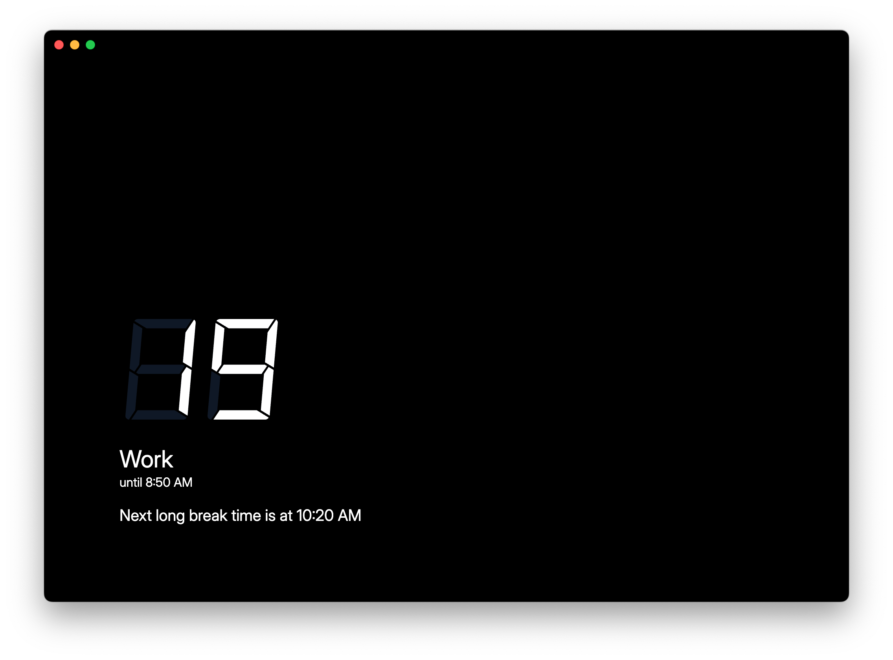

# pomodoro
A Pomodoro timer that utilizes [Toggl Track](https://toggl.com/track/).

## Why not use the Pomodoro feature in Toggl Track?
While the feature is excellent, there are occasions when I am unable to fully utilize the app on my current device. I could use the iPhone app, but due to its limitations, I would need to keep the app open continuously for it to automatically switch Pomodoro intervals, which would waste my phone's resources. Furthermore, the Pomodoro timer on Toggl Track does not support long breaks.

Additionally, this would be a nice display to use with a spare external monitor and Raspberry Pi.

## Usage
**Warning:** This app is in its early stages of development.
1. Obtain a [Toggl Track API token](https://track.toggl.com/profile) (The link directs you to the profile page, you can find the API token towards the bottom). Ensure that you keep this a secret!
2. Launch the app and input your API token. As the app is still under development, it doesn't yet have the ability to save this information. I am currently exploring solutions for securely storing this data. As long as you don't exit the app, your session will persist.
3. Start a timer in Toggl Track. That's it! As your Toggl Track session continues, this app will track the intervals and provide auditory notifications to indicate different intervals.

As of now, the interval durations cannot be changed through the UI. The default times are:
1. 25 minutes of work
2. 5 minute short break
3. Repeat steps 1 and 2, two more times
5. Do step 1
6. 20 minute long break
7. Repeat everything starting from step 1

These steps are based off the [Pomodoro Technique Wikipedia Page](https://en.wikipedia.org/wiki/Pomodoro_Technique).
